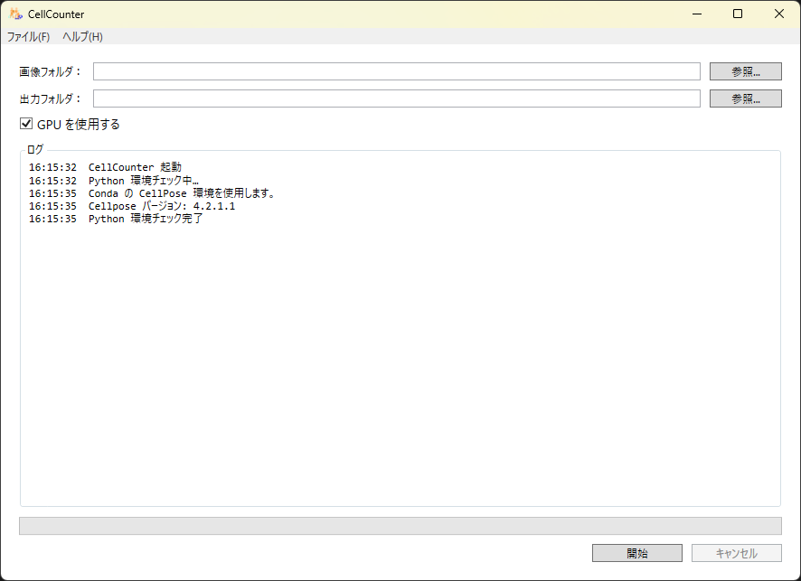
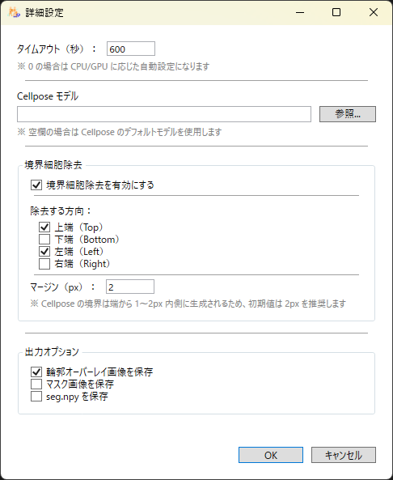

# CellCounter

## 📘 Cellpose を GUI から扱える画像解析アプリ

CellCounter は **Cellpose + PyTorch** をバックエンドに用いて、
GUI から画像フォルダを指定するだけで **細胞セグメンテーション・カウント・境界除去・CSV 出力・輪郭オーバーレイ生成**を行うアプリケーションです。

---

## 🔧 必要環境

CellCounter は **Cellpose を Python で実行するため、Python 環境が必要**です。

### ✔ Python の扱い

- CellCounter は Python を同梱しません
- 起動時にユーザー環境の Python を自動検出します
- Python が見つからない場合は Cellpose 推論を開始できません
- Cellpose / PyTorch / NumPy / SciPy の import 可否を起動時にチェックします

### 📦 Python runtime（オプション）

Python をお持ちでない場合は、以下の **CellCounter 用 Python runtime（site-packages のみ）**を利用できます：

👉 https://github.com/bpse-simulation/CellCountX/releases/tag/python-runtime

#### ⚠ 重要：この Python runtime は **site-packages のみ**です

含まれるもの：

- Cellpose
- PyTorch
- NumPy
- SciPy
- その他必要ライブラリ

含まれないもの：

- **Python 本体（python.exe / DLL）**
- **python312._pth（埋め込み版のパス設定ファイル）**

埋め込み Python を使う場合は、以下を別途用意してください：

- Windows embeddable package (64-bit)
https://www.python.org/downloads/windows/

---

## 🖥️ GUI 概要

### メイン画面



- **画像フォルダ**
- **出力フォルダ**
- **GPU 使用**（利用可能な場合のみ有効）
- **ログ表示領域**
    - Python 環境チェック
    - Cellpose バージョン
    - GPU 利用可否
- **開始ボタン**（Python が有効な場合のみ活性）
- **キャンセルボタン**

ログ例：

```
CellCounter 起動
Python 環境チェック中…
Conda の Cellpose 環境を使用します。
Cellpose バージョン: 4.2.1.1
Python 環境チェック完了
```

---

## ⚙️ 詳細設定



詳細設定では、Cellpose 推論・境界除去・出力形式を細かく制御できます。

### 🕒 タイムアウト（秒）

- 指定した秒数で Python 推論を強制終了
- **0 の場合は CPU/GPU に応じて自動設定**

### 🧠 Cellpose モデル

- 任意のモデルファイルを指定可能
- **空欄の場合は Cellpose のデフォルトモデルを使用**

### 🧹 境界細胞除去

- **境界細胞除去を有効にする**
- 除去方向
    - 上端 / 下端 / 左端 / 右端
- **マージン（px）**
    - 初期値：2px
    - Cellpose の境界細胞は 1〜2px 内側に生成されるため 2px を推奨

### 📦 出力オプション

- **結果オーバーレイ画像を保存**
- **マスク画像を保存**
- **seg.npy を保存**

---

## 🚀 主な機能

### 🧠 Cellpose 推論（GPU 対応）

- Python の自動検出
- Cellpose import 判定
- GPU 利用可否の自動判定
- 推論結果を JSON で受け取り処理

---

## 🔍 Python 環境チェック

起動時に以下を自動判定します：

- Python の存在
- Cellpose の import 可否
- GPU 利用可否
- Cellpose バージョン

Python が利用できない場合は「開始」ボタンが無効化されます。

---

## 🧹 画像端の細胞除去（境界除去）

Cellpose は画像端の細胞を途切れた状態で検出することがあります。
CellCounter では以下の設定により **境界細胞を除去**できます：

- 上端 / 下端 / 左端 / 右端
- マージン（初期値 2px）

除去された細胞はオーバーレイ画像で **赤色の輪郭**として描画されます。

---

## 🎨 輪郭オーバーレイ画像の生成

Cellpose のマスクをもとに、CellCounter が元画像へ輪郭を重ねた画像を生成します。

- 採用された細胞 → 緑の輪郭
- 境界除去された細胞 → 赤の輪郭

生成されるファイル（保存オプションが有効な場合）：

- `{base}_overlay.png`

---

## 🧩 Cellpose 標準出力（保存オプションが有効な場合）

- `{base}_cp_masks.png`
- `{base}_seg.npy`（flows / masks / styles）

---

## 📄 解析設定ログ（settings.json）

以下の設定が自動的に記録されます：

- Cellpose モデル
- 境界除去設定
- タイムアウト
- GPU/CPU 使用状況
- 入力・出力パス

解析の再現性を確保するためのログです。

---

## 📊 バッチ処理 + CSV 出力

- フォルダ内の画像を一括処理
- 進捗バー表示
- `cells.csv` を出力
    - FileName
    - CellCount
    - FilteredCount
    
    ---
    

## 🧩 出力ファイル一覧

| 種類 | ファイル名 | 内容 |
| --- | --- | --- |
| 輪郭オーバーレイ画像 | `{base}_overlay.tif` | 緑＝採用 / 赤＝境界除去 |
| マスク画像 | `{base}_cp_masks.png` | Cellpose 標準のマスク画像 |
| seg.npy | `{base}_seg.npy` | flows / masks / styles |
| 解析設定ログ | `settings.json` | 推論設定の記録 |
| 解析結果 | `cells.csv` | CellCount / FilteredCount |

---

## 🖥️ 使い方

1. 画像フォルダを選択
2. 出力フォルダを選択
3. 詳細設定を開く
4. 「開始」でバッチ処理開始
5. `settings.json` と `cells.csv` が保存されます
6. 「キャンセル」で即時中断

---

## ⚠️ 注意事項

- Cellpose が Unicode パスに対応していないため、全角パスは使用不可
- Python は同梱されません
- python-runtime は **site-packages のみ**であり、Python 本体は含まれません
- Embeddable Python を使う場合は python312._pth の配置が必要です

---

## 🧩 アーキテクチャ概要

### PythonServer（C#）

- Python を起動して server.py を実行
- Cellpose import / GPU 利用可否を判定
- 推論を JSON で送受信
- タイムアウト時はプロセスを Kill

### server.py（Python）

- Cellpose 推論
- 境界細胞除去
- マスク・seg.npy 保存
- オーバーレイ画像生成
- 結果を JSON で返却

### BatchProcessor

- 画像フォルダを走査
- PythonServer を呼び出し
- CSV 出力
- 非同期 + キャンセル対応

---

## 📂 プロジェクト構成

```
CellCounter.Wpf/
├── View/
├── ViewModel/
├── Logic/
├── Model/
├── python_embed/
└── CellCounter.Wpf.csproj

CellCounter.Py/
├── server.py
├── get_cellpose_info.py
├── remove_edge_cells.py
├── overlay.py
└── cellpose/
```

### 配布時の構成

```
CellCounter/
├── CellCounter.exe
├── server.py
├── get_cellpose_info.py
├── remove_edge_cells.py
└── overlay.py
```

---

## 📄 CSV 出力形式

| FileName | CellCount | FilteredCount |
| --- | --- | --- |
| image001.png | 123 | 120 |
| image002.png | 98 | 95 |

---

## 🛠️ Cellpose バックエンド環境構築

```bash
python -m venv cellpose
cellpose\Scripts\activate
pip install cellpose
pip uninstall torch
pip3 install torch torchvision --index-url https://download.pytorch.org/whl/cu126
pip install packaging
```

---

## 📜 ライセンス

MIT ライセンスを推奨します。
Cellpose のライセンスに従います。

---

## 🙌 作者

- 開発: BPSE-Lab
- アーキテクチャ設計: PythonServer / PythonClient / BatchProcessor / MVVM
- 画像解析: Cellpose + PyTorch